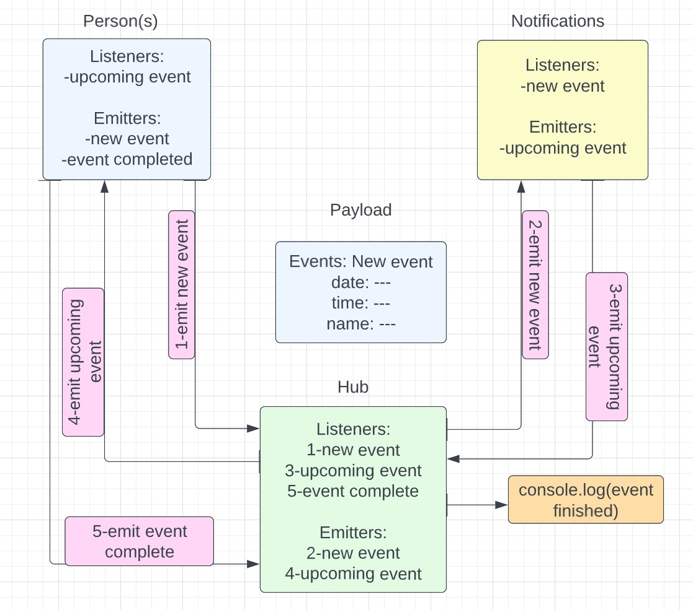

# Lab14

## Description

In this server/socket setup we want to mock up a potential calendar notification system where a user can add an event and get's notified 15 (or another amount of time) minutes before the event, and then when the user goes to the event he will mark off that he went there  

